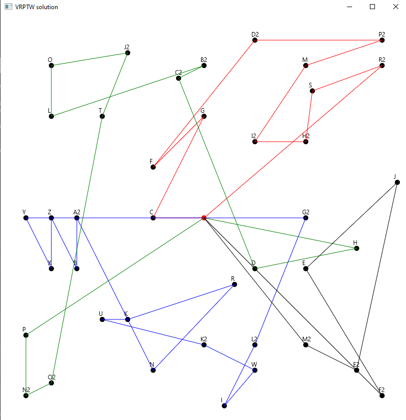

# Vehicle Routing Problem

Java implementation of Vehicle Routing Problem with Time Windows.
The project includes 3 implementations of popular algorithms:
* **Tabu search**
* **Simulated annealing**
* **Ant colony optimization**

Each of these algorithms uses greedy algorithm for generating initial solution.
Program can be run in 2 ways: as console application or as JavaFx window application.

Minimal required java version: **12**

# Running the program

The program is controlled through VM options. Each param has its default values.

* **numberOfVehicles** _(default 4)_ - maximum number of vehicles that algorithm should use.
Algorithms try to use as little vehicles as possible.
* **vehicleCapacity** _(default 50)_ - initial capacity of each vehicle.
* **method** _(default TABU)_ - method used to solve problem.
Available options: **_GREEDY, TABU, SA, ANT_**
* **startHour** _(default 4)_ - integer number that defines stating hour of each vehicle.
It is used for time windows.
* **inputFile** _(default 'src/main/resources/initialData/inputCSVData3.csv')_ - data input file.
* **runCount** _(default 10)_ - used for probabilistic algorithms (currently Simulated Annealing and ACO),
the program is run this many times and the best result is returned.

Easiest way to run the project is by downloading apache maven. After that, open command line in cloned project and run:

`mvn compile`

and next

`mvn exec:java -Dexec.mainClass=VRP_Main ...other VM options`

for example:

`mvn exec:java -Dexec.mainClass=VRP_Main -DnumberOfVehicles=4 -DvehicleCapacity=50 -Dmethod=tabu -DstartHour=4
-DinputFile="D:\Program Files\VRP\src\main\resources\initialData\inputCSVData3.csv"`

Response:

# Running the JavaFx program

Example of running JavFx application:

`mvn clean javafx:run -Dmethod=SA -DvehicleCapacity=50 -DnumberOfVehicles=4 -DstartHour=4 -DrunCount=50`

As a result of this operation, a window with routes (each vehicle with different color) will be presented as shown below:

# Input file

Input file must be in .csv format with specific headers:

**_name;x;y;demand;availableFrom;availableTo;serviceTime_**

